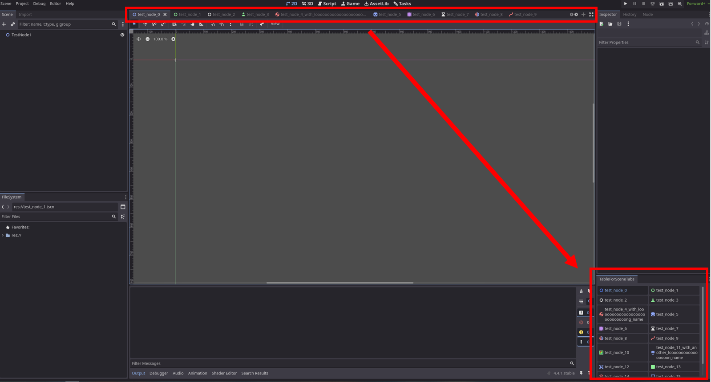
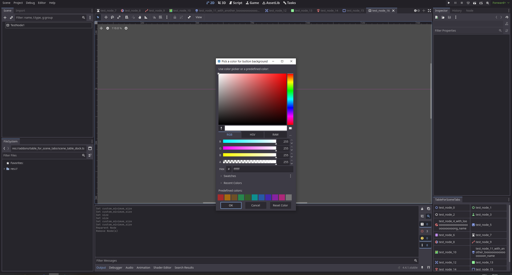
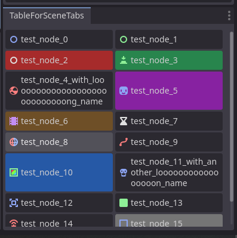

# Table-For-Scene-Tabs
This simple plugin for Godot adds a dock with a table that shows all open scenes as buttons. Right-click a button to change its background color.

## Setup
1. Import addon from asset store or download as zip then unpack at `addons/table_for_scene_tabs`
1. Activate plugin via `Project > Project Settings > Plugins > TableForSceneTabs - [] Enable`

## Screenshots

